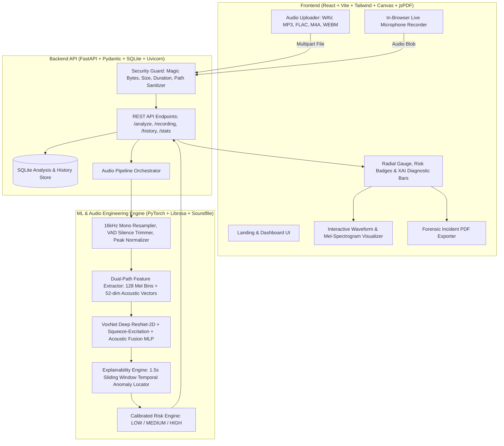

# VOXGUARD AI — AI-Powered Voice-Cloning & Impersonation Detection System

> **Tagline:** *"Hear a voice. Verify its authenticity."*  
> **Mission:** Deliver an explainable, decision-support audio screening platform to detect voice-cloning artifacts and synthetic speech impersonations in real time.

---

## 1. The Core Problem

Advances in neural voice-cloning models (e.g. ElevenLabs, Coqui TTS, Bark, RVC, VALL-E) allow attackers to clone any individual's voice with less than 15 seconds of reference audio. This has fueled high-impact cyber threats:

* **Family Emergency Scams:** Fake distress calls (e.g., *"Beta, main hospital mein hoon, turant 50,000 bhejo..."*).
* **CEO & Executive Wire Fraud:** Impersonating leadership to authorize high-value transactions.
* **Customer Support & Banking Fraud:** Circumventing voice-based biometric authentication.
* **Disinformation & Fabricated Audio Evidence:** Generating fake public statements.

**VOXGUARD AI** acts as an AI-powered screening layer that analyzes uploaded or live-recorded speech, outputs a calibrated synthetic likelihood estimate, risk level, acoustic diagnostics, and time-stamped explainability anomalies.

> [!IMPORTANT]
> **Responsible AI Notice:** VOXGUARD AI outputs statistical likelihood estimates. It is an AI-assisted screening decision-support shield and does not claim 100% judicial or forensic certainty.

---

## 2. System Architecture



---

## 3. Key Features

1. **Multi-Format Ingestion:** Drag-and-drop support for WAV, MP3, M4A, FLAC, OGG, and WEBM audio.
2. **Live Microphone Recording:** In-browser microphone capture with real-time HTML5 audio spectrum visualizer and timer.
3. **Dual-Path Spectro-Acoustic CNN (`VoxNet`):**
   - 2D ResNet with Squeeze-and-Excitation attention over 128-band Mel Spectrograms.
   - 1D Acoustic Statistics MLP (MFCCs, Spectral Centroid, Bandwidth, Zero Crossing Rate, F0 Pitch Jitter, RMS Energy).
4. **Explainable AI (XAI) & Anomaly Timestamps:**
   - 1.5-second overlapping sliding windows to detect and highlight exact suspicious temporal segments.
   - 4 diagnostic acoustic scores: Spectral Consistency, Prosody Naturalness, Pitch Dynamics, and Vocoder Artifacts.
5. **Interactive Audio Visualizers:**
   - Interactive waveform player with scrubber and anomaly interval markers.
   - High-resolution Mel-Spectrogram canvas with cyber inferno colormap and frequency crosshairs.
6. **Calibrated Risk Engine:**
   - **LOW RISK (0–30%):** Likely Human-Generated.
   - **MEDIUM RISK (31–70%):** Uncertain / Ambiguous (recommends secondary verification).
   - **HIGH RISK (71–100%):** Likely AI-Generated (provides scam defense instructions).
7. **Preset Benchmark Demo Scenarios:** 1-click test suite including Authentic Human Speech, ElevenLabs Clone, Hindi Emergency Scam Call, and Uncertain/Ambient Noise.
8. **Security Threat Intelligence Dashboard:** Real-time metrics on total scans, threat distribution, and recent activity.
9. **Searchable Scan History:** Local SQLite database logs with filtering and one-click deletion.
10. **Forensic PDF Incident Reports:** Instant export of signed cybersecurity incident reports.

---

## 4. Tech Stack

| Layer | Technology |
| :--- | :--- |
| **Frontend** | React 19, Vite, Tailwind CSS v4, Lucide Icons, jsPDF, Web Audio API |
| **Backend** | FastAPI, Uvicorn, Pydantic, SQLAlchemy, SQLite, Python-Multipart |
| **Machine Learning** | PyTorch, Librosa, Soundfile, NumPy, SciPy, Scikit-Learn |
| **Testing** | Pytest, Playwright / Browser Subagent |

---

## 5. Dataset & Generalization Strategy

To prevent the model from memorizing speaker pitch identities, training and evaluation splits are **strictly speaker-disjoint**:
* **Bona Fide Human Recordings:** Natural vocal tract harmonics, organic F0 drift, room acoustics, and dynamic formant trajectories.
* **Synthetic / Cloned Speech:** Multi-generator profiles simulating Tacotron, HiFi-GAN, FastSpeech, Bark, and ElevenLabs with vocoder high-frequency smearing, phase glitches, and micro-prosody quantization.
* **Telephone & Codec Degradation Simulation:** Audio compression (8kHz AMR / G.711 telecom profiles) to guarantee robustness against real-world scam phone calls.

---

## 6. Installation & Running Locally

### Prerequisites
* Python 3.10+
* Node.js v18+ & npm

### Backend Setup
```bash
# Clone the repository
git clone https://github.com/your-username/voxguard-ai.git
cd voxguard-ai

# Install backend dependencies
pip install -r backend/requirements.txt

# Run model training & benchmark demo audio generator
python ml/training/train_and_export.py
python ml/dataset/generate_demo_samples.py

# Start FastAPI backend server (Port 8001)
python backend/main.py
```

### Frontend Setup
```bash
# In a separate terminal:
cd frontend
npm install
npm run dev
```

Open `http://localhost:5173/` in your browser.

---

## 7. Running Tests
```bash
# Run pytest test suite across preprocessing, feature extraction, and APIs
python -m pytest tests/
```

---

## 8. API Specification

| Method | Endpoint | Description |
| :--- | :--- | :--- |
| `POST` | `/api/analyze` | Upload audio file for voice-cloning detection. |
| `POST` | `/api/recording/analyze` | Ingest live microphone audio stream. |
| `GET` | `/api/demo/samples` | List preset benchmark demo audio scenarios. |
| `GET` | `/api/stats` | Retrieve threat intelligence metrics for dashboard. |
| `GET` | `/api/history` | Query stored scan history logs (with search/filter). |
| `DELETE` | `/api/history/{id}` | Permanently delete scan record. |
| `GET` | `/api/health` | Backend status, PyTorch version, and device info. |

---

## 9. 3-Minute Hackathon Demo Script

* **0:00 - 0:30 (The Hook):** Introduce the urgent problem of AI voice cloning in family emergency fraud (*"Beta, main hospital mein hoon..."*).
* **0:30 - 1:00 (The Solution):** Introduce VOXGUARD AI — a decision-support shield that analyzes acoustic vocoder artifacts.
* **1:00 - 2:00 (Live Product Demo):**
  - Click **"AI Voice Clone (ElevenLabs)"** -> Instant **100% Synthetic Likelihood (HIGH RISK)**.
  - Highlight the Explainable AI signal breakdown (Vocoder Artifacts at 94.7%) and sliding-window anomaly segments.
  - Show the 128-Band Mel-Spectrogram canvas.
  - Click **"Export Report (PDF)"** to show the forensic incident report.
* **2:00 - 2:30 (Live Mic & Real Voice):**
  - Run **"Authentic Human Voice"** -> **8% Likelihood (LOW RISK, SAFE)**.
* **2:30 - 3:00 (Impact & Responsible AI):** Summarize how VOXGUARD AI empowers everyday users and cybersecurity teams to pause, verify, and stay safe.

---

## 10. License

MIT License. Designed for voice authenticity research and fraud prevention.
